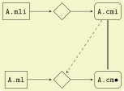
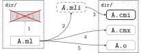
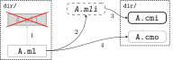

= OCaml: Build Protocols
:page-permalink: /:path/build-protocols
:page-layout: page_rules_ocaml
:page-pkg: rules_ocaml
:page-doc: sdk
:page-sidebar: rules_ocaml_sdk_sbdata
:page-parent: ['../ocamlsdk']
:page-tags: [ocaml,build]
:page-keywords: notes, tips, cautions, warnings, admonitions
:page-last_updated: Mar 18, 2025
:toc-title:
:toc: true

== link:https://v2.ocaml.org/manual/compunit.html#s:compilation-units[Compilation Units]

"Compilation units bridge the module system and the separate
compilation system. A compilation unit is composed of two parts: an
interface and an implementation. The interface contains a sequence of
specifications, just as the inside of a `sig … end` signature
expression. The implementation contains a sequence of definitions and
expressions, just as the inside of a `struct … end` module expression.
A compilation unit also has a name `unit-name`, derived from the names
of the files containing the interface and the implementation"
-- link:https://v2.ocaml.org/manual/compunit.html#s:compilation-units[Chapter 9.12 'Compilation Units',window="_blank"]

"A compilation unit is composed of two parts: an interface and an
implementation." No, it is composed of two _files_, both _compiled_,
one for the interface and one for the implementation. It's important
not to gloss over the difference between file-system stuff and
language stuff: "interface" and "implementation" are language-level
concepts independent of file-system organization.

"A compilation unit also has a name `unit-name`, derived from the
names of the files containing the interface and the implementation".
The problem with this is that there is no "compilation unit" in the
file system, so there is nothing to name. The _module_ composed of a
sigfile and a structfile has a name, but a module is not a compilation unit.

[quote, 'link:https://v2.ocaml.org/manual/moduleexamples.html#s:separate-compilation[5. Modules and separate compilation]']
____
A compilation unit A comprises two files:

* the implementation file A.ml, which contains a sequence of definitions, analogous to the inside of a struct…end construct;
* the interface file A.mli, which contains a sequence of specifications, analogous to the inside of a sig…end construct.

These two files together define a structure +[sic]+ named A as if the following definition was entered at top-level:
----
module A: sig (* contents of file A.mli *) end
        = struct (* contents of file A.ml *) end;;"
----
____

"These two files together define a structure" - no, they define a
_module_. This kind of language can be very, _very_ confusing to
newcomers.

OBazl eschews this terminology on grounds that a) it conflates the
concepts "module" and "compilation unit", and b) a compilation _unit_
should be non-decomposible.

The "bridge" between the (language-defined) module system and the
"separate compilation system" is the build discipline defined by the
tools.

In fact it is difficult to give a clear, concise, and simple
definition of "unit of compilation" for OCaml. Why? UoC spans both the
language and the tooling. On the one hand the UoC for the language is
any minimal bit of syntax that can be compiled. But from the
perspective of building, unit of compilation usually means "source
file" or similar. That is, it is file-system oriented. Hence
"file-system unit of compilation"? And since "module" is a concept of
the language, not the build system (ie. not involving the FS), it
cannot be a FS unit of compilation.

FS UoC v. OCaml UoC

The FS units of compilation are sigfiles and structfiles. But this
does not mean that units of compilation can always be _independently_
compiled. In practice the units of compilation are sigfiles and
structfiles _together with_ their dependencies.

And to complicate things: a _compiled_ module is itself a composite of
two compiled units, the struct and the sig.

The docs say "A compilation unit is composed of two parts: an
interface and an implementation." OBazl says: a module is composed of
two compilation units. Or more precisely, a module is composed of a
signature and a structure; _filesystem_ module is composed of two
compilation units, a (compiled) sigfile and a (compiled) structfile.

1. Structfiles always depend on compiled sigfiles.
2. Both may depend on other compiled modules, via OCaml's `include`
directive.

== File Types

[cols="1,1,1,1"]
|===
| action | input | output | remarks

| compile sig | a.mli | a.cmi |

| compile struct | a.ml | a.cmo, a.cmi | bytecode compile
| compile struct | a.ml | a.cmx, a.o, a.cmi | native compile

| compile struct | a.ml, a.cmi | a.cmo | bytecode compile
| compile struct | a.ml, a.cmi | a.cmx, a.o | native compile

| archive | a.cmo | a.cma | bytecode
| archive | a.cmx, a.a | a.cmxa, a.a | native

| link | a.cmo, a.cma | a.byte | bytecode executable
| link | a.cmx, a.o, a.cmxa, a.a | a.out | native executable

|===

Q: a.cmi input to archive action? iow can an archive contain a standalone sig?

Q: what about dynamic linking, e.g. a.cmxs?

== Runtimes

=== System runtimes

When linking an executable, the compilers search for a target runtime to link.

Sys target: liibasmrun, libasmrunc, libasmruni - see asmcomp/asmlink.ml

VM target: custom runtime looks for -lcamlrun, -lcamlrund, etc. (bytecomp/bytelink.ml)

VM target w/o custom runtime: the emitted executable does not need a runtime, since it will run on the vm, which contains the runtime already.

VM interpreter (ocamlrun) is statically linked with libcamlrun.a (or libcamlrund.a etc.)

That makes those runtime files inputs to the build, which means they
must be explicitly listed as dependencies for rules that run the ocaml linkers.

So our toolchains have a `target_runtime` attribute. To use e.g. a
debug runtime, we use a config_setting, e.g.
`--@ocaml//toolchain/debug`. That puts a debug runtime in the
toolchain, but the problem is that `--@ocaml//toolchain/debug` is
global, and we may want a debug runtime for only one target, e.g a
test executable.

So we include all runtimes in the tc. The debug flag selects the
default runtime for the tc, but a rule may use some other flag to
select a different runtime, overriding the default.

That's for ocaml code. If you are using the C SDK, you may also need to
link a runtime to your c libs. E.g. if you want to embed ocaml in c:

link:https://v2.ocaml.org/manual/intfc.html#ss:c-embedded-code[Embedding the OCaml code in the C code]

similar if you use -output-obj etc.

NB: when you link with -custom the runtime is automatically added

So the challenge for the obazl code is to determine which runtime to add as a runtime dep, and when to explicitly list it on the cmd line.

=== VM runtimes

Bytecode executables run on a virtual machine. The standard VM is
`ocamlrun`; this is often referred to as a “runtime” or “interpreter”.
OBazl calls it a “vm runtime”. This is not entirely accurate, since
technically speaking `ocamlrun` et al. contain more than just the
runtime system. But it’s close enough.

Two other vm runtimes are available: `ocamlrund` (for debugging) and
`ocamlruni` (for instrumentation).

In addition, OCaml supports several ways to customize the vm runtime:

* Passing `-custom` to `ocamlc` tells it to embed the runtime in the
  bytecode executable, which can then be run directly (without `ocamlrun`).
* Passing `-output-complete-exe` tells `ocamlc` to “[b]uild a
  self-contained executable by linking a C object file containing the
  bytecode program, the OCaml runtime system and any other static C
  code given to ocamlc.” The resulting executable can be run directly.
* Passing `-make-runtime` tells `ocamlc` to generate a vm runtime containing C object files and libraries passed on the command line; the resulting vm runtime can then be used instead of `ocamlrun` to execute bytecode executables produced using `-use-runtime`.
* Options `-with-runtime` and `-without-runtime` afford further customization.

== Modules and the File System

link:https://v2.ocaml.org/manual/comp.html#s:modules-file-system[Modules and the file system,window="_blank"]

=== Signature compilation

=== Dyadic Modules

A _dyadic_ module is a filesystem module composed of a structfile and a sigfile.

=== Singleton structfiles

An _singleton_ structfile is a structfile with no corresponding
sigfile; that is, no sigfile with matching principal name _in the same
directory_. It is possible to have one or more matching sigfiles in
other directories, but only a sigfile in the same directory may count
as a "matching" sigfile.

NOTE: principal name = file name with extension removed. E.g. the
principal name of `foo.ml` is `foo`.

A _singleton module_ is a filesystem module derived from a singleton
structfile. Singleton modules are still composed of two compilation
units, one for the signature and one for the structure, but the
signature is the principal signature inferred from the singleton
structfile. For example, from singleton structfile `A.ml` the
compiler with infer and then compile `A.mli`. The compiler will emit
`A.cmi` but not `A.mli`.

.Native
[.left.text-center]

.Bytecode
[right.text-center]

=== Principal Signatures

The compiler can extract the principal signature from a module if you
pass it the `-i` option. For this to work, though, all dependencies -
structs and sigs - must be compiled first, so it is not as simple as
passing the structfile source to the compiler with the `-i` flag.

WARNING: The rest of this section is outdated and no longer accurate.

The OBazl rule `ocaml_module` does not support the `-i` option; adding
it would complicate the rule implementation for little benefit, since
another method is available.

The alternative is to compile the module and then use a third-party
utility named `cmitomli` to extract the (textual) sigfile from the
compiled `.cmi` file. This is supported by tooling in `tools_obazl`.
So if you want to extract the principal signature for a structfile,
you can use:

----
$ bazel run @tools_obazl//sig:extract --@tools_obazl//ocamlobj=//package:target
----

This tool will `build` the target `//package:target` and then run
`cmitomli` (which you must have installed in the OPAM switch you're
using; see X for more information on this) on the emitted `.cmx/.cmo` file.

You can shorten this by defining a `flag_alias` in your `.bazelrc`:

----
build --flag_alias=obj=@tools_obazl//ocamlobj
----

Then you can run:

----
$ bazel run @tools_obazl//sig:extract --obj=//package:target
----

You can shorten it further by defining a local alias for
`@tools_obazl//sig:extract`; e.g. in your root `BUILD.bazel` file:

----
alias(name = "gensig", actual = "@tools_obazl//sig:extract")
----

Then you can run:

----
$ bazel run :gensig --obj=//package:target
----

=== Cross-Module Optimization

"When the native compiler compiles an implementation, by default it produces a .cmx file containing information for cross-module optimization. It also expects .cmx files to be present for the dependencies of the currently compiled source, and uses them for optimization. Since OCaml 4.03, the compiler will emit a warning if it is unable to locate the .cmx file of one of those dependencies."
-- Ch 14 Native-code compilation

In other words, the `.cmx` files are only needed for cross-module
optimization. The `.cmi` files, by contrast, are always needed for
symbol resolution. Both are needed for linking to an executable.

Which suggests that the code produced by compiling a module contains
only references to its dependencies; it does not embed the referenced code.

In other words, a compiled OCaml module is analogous (for build
purposes) to a C library. To link it you must list it explicitly as a
linkable resource so the linker knows about it, but to compile
something that depends on it you only need the `.cmi` file.

Or: the .cmi files are analogous the C header files. You do not need
the compiled dep in C to compile your client code to a `.o` file; you
only need the headers with function prototypes, etc. It's only when
you go to link your `.o` files into a library or executable that you
need the `.o` files it depends on; you don't need them when you're
compiling.

Same story for OCaml .cmi and .cmx files. You don't need the .cmx file
of a dep to compile your code (unless you want cross-module
optimization), but you do need the .cmi file that exposes the
interface of the .cmx file, and you need the .cmx file to link your
(compiled) code.

* `-opaque`
* `-no-alias-deps`

If a module A depends on module B:

* compilation of module A always depends on b.cmi, but may not depend on b.cmx.
** b.cmx is only needed for cross-module optimization, which may be disabled by `-opaque`
* linking module A into an executable always requires b.cmx (and b.cmi) to be linked first
* linking module A into an archive means ...?

In other words, "module dependency" has multiple meanings. We have
compile-time dependencies and link-time dependencies, and they are not
necessarily the same.

In other other words, the OCaml compilers conflate compilation and linking.

== Module Dependencies

1. Always means "signature dep"
2. Sigs then depend on structs

=== The `open` and `include` directives

NOTE: The OCaml language definition does not use the term "directive" for these keywords.

Compare the C build discipline. A source file like `foo.c` is a unit
of composition, but only _after_ preprocessing. If `foo.c` contains
`#include "foo.h"`, then the textual content of the latter will be
embedded in the textual content of the former, forming the compilation
unit.

The OCaml `include` directive does not work textually like this. If
the text of module `A` contains `include B`, this tells the compiler
to embed module `B` _compiled_ in module `A`.

For sigs: link:https://v2.ocaml.org/manual/modtypes.html#sss:mty-include[Including a signature,window="_blank"]

FIXME: "The expression `include module-type` in a signature performs
textual inclusion of the components of the signature denoted by
`module-type`. ". Not clear what "textual inclusion" means. Does it
mean the source text? I don't think it can. `module-type` does
not necessarily correspond to a source file.

For structs: link:https://v2.ocaml.org/manual/modules.html#sss:mexpr-include[Including the components of another structure,window="_blank"]

"The expression include module-expr in a structure re-exports in the current structure all definitions of the structure denoted by module-expr. "

== Executables

* link:https://v2.ocaml.org/manual/native.html#s:native:running-executable[Running executables produced by ocamlopt,window="_blank"] Executables generated by ocamlopt are native, stand-alone executable files that can be invoked directly. They do not depend on the ocamlrun bytecode runtime system nor on dynamically-loaded C/OCaml stub libraries.

== misc notes

The OCaml compilers and tools are very flexible. In particular,
bytecode builds can be customized in a variety of ways.

* meaning of "library"
* Build modes
* Multiple outputs
** Output file types:
*** `.cmo/.cmx`
*** `.cmi`
*** `.o/.a`, `.obj/.lib`
*** `.cma/.cmxa`
*** `.cmxs`
*** `.cmt/.cmti`
*** `.cmir-linear`
*** etc.
** "compilation unit"
** "auxiliary" outputs, e.g. cmt/cmti, intermediate files (asm, etc.)
* custom runtime mode  (for bytecode output)
** `-custom` - linker produces an output file that contains both the runtime system and the bytecode for the program.
** `-make-runtime` - Build a custom runtime system, to be used later to execute bytecode executables produced with the `ocamlc -use-runtime runtime-name` option.
** `-use-runtime` - Generate a bytecode executable file that can be executed on the custom runtime system built earlier with `ocamlc -make-runtime`
* `-pack` and `-for-pack`
* `-nostdlib` - use customized stdlib
* `-i` -  emit interface file
* `-output-obj` - Cause the linker to produce a C object file instead of a bytecode executable file. This is useful to wrap OCaml code as a C library, callable from any C program.
* `-output-complete-exe` - Build a self-contained executable by linking a C object file containing the bytecode program, the OCaml runtime system and any other static C code given to ocamlc.
* `-output-complete-obj` Same as -output-obj options except the object file produced includes the runtime and autolink libraries.
* Dependencies
* Namespacing
* Preprocessing
** `-pp`
** `-ppx`
* `-runtime-variant d` - use debug version of runtime
* `-stop after <pass>` passes: parsing, typing
* `-save-ir-after <pass>` - passes: scheduling. Experimental, native code only
* `-S`  keep assembly code

Special consideration:  `-open`
